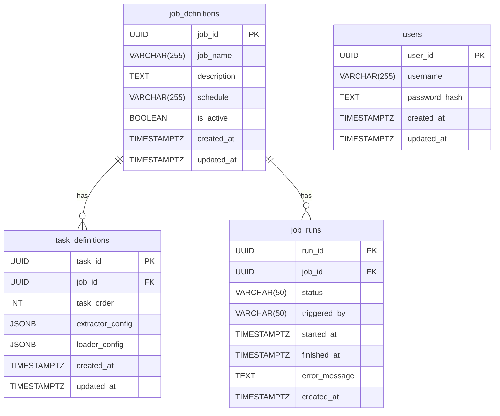

# Database Relationships

This document describes the relationships between the tables in the `orc-rust-ator` database and includes a diagram to visualize these relationships.

## Relationships

-   A `job_definition` can have multiple `task_definitions`. This is a one-to-many relationship, with the `job_id` in the `task_definitions` table being a foreign key that references the `job_id` in the `job_definitions` table.
-   A `job_definition` can have multiple `job_runs`. This is a one-to-many relationship, with the `job_id` in the `job_runs` table being a foreign key that references the `job_id` in the `job_definitions` table.
-   The `users` table is not directly related to any of the other tables. It is used for API authentication and is managed independently.

## Diagram

The following diagram illustrates the relationships between the tables:

