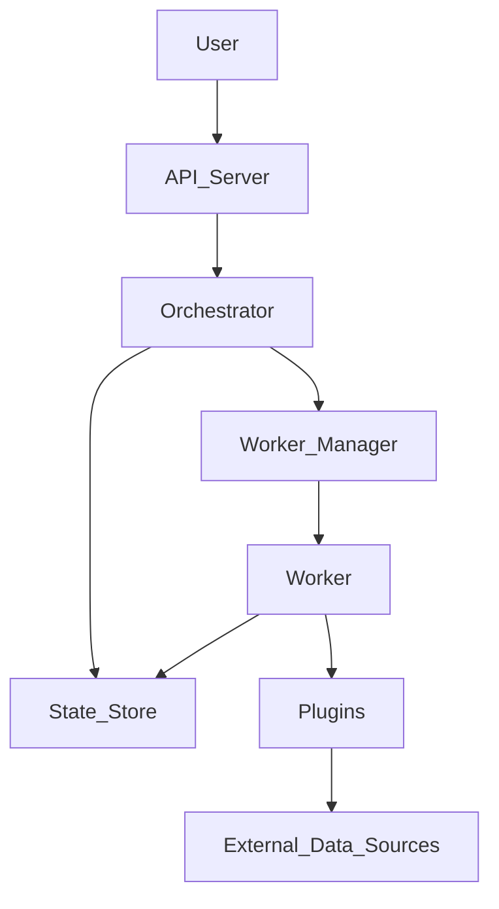

# System Design Document: Orc-Rust-Ator

## 1. Introduction

This document outlines the system design for the `orc-rust-ator` project, a robust and scalable orchestration engine for data extraction, transformation, and loading (ETL) tasks. It details the architecture, core components, data models, API, and deployment considerations.

## 2. Goals and Objectives

- **Reliability:** Ensure high availability and fault tolerance for job execution.
- **Scalability:** Support a growing number of jobs, tasks, and concurrent workers.
- **Extensibility:** Allow easy integration of new data sources (extractors) and destinations (loaders).
- **Observability:** Provide comprehensive monitoring and logging capabilities.
- **Usability:** Offer a user-friendly API and CLI for managing and monitoring ETL workflows.

## 3. Architecture Overview

The `orc-rust-ator` follows a microservices-oriented architecture, separating concerns into distinct, independently deployable components. The core components are:

- **API Server:** Provides a RESTful interface for external interaction.
- **Orchestrator:** Manages job scheduling, task queuing, and worker coordination.
- **Worker:** Executes individual tasks (extraction, loading).
- **State Store:** Persists job definitions, run history, and task status.
- **Plugins:** Extensible modules for data extraction and loading.

## 4. Core Components

### 4.1. API Server

- **Technology:** Rust with `actix-web` (or similar web framework).
- **Responsibilities:**
    - Expose RESTful endpoints for job management (CRUD).
    - Handle authentication and authorization.
    - Provide real-time job status updates.
    - Serve CLI requests.

### 4.2. Orchestrator

- **Technology:** Rust.
- **Sub-components:**
    - **Job Manager:**
        - Manages job definitions (creation, update, deletion).
        - Validates job configurations.
        - Triggers job runs based on schedules or API requests.
    - **Scheduler:**
        - Uses a cron-like mechanism to determine when jobs are due.
        - Pushes due jobs to a job queue.
    - **Worker Manager:**
        - Monitors worker health and availability.
        - Dispatches tasks to available workers.
        - Handles worker registration and de-registration.

### 4.3. Worker

- **Technology:** Rust.
- **Responsibilities:**
    - Fetches tasks from the task queue.
    - Executes tasks using the appropriate extractor and loader plugins.
    - Reports task status and progress to the State Store.
    - Implements robust error handling and retry mechanisms.

### 4.4. State Store

- **Technology:** SQLite (for simplicity in initial deployment, extensible to PostgreSQL/other RDBMS).
- **Responsibilities:**
    - Persist `job_definitions`, `job_runs`, and `tasks` data.
    - Provide transactional data access.
    - Ensure data consistency and integrity.

### 4.5. Plugins

- **Technology:** Rust (dynamic loading or compile-time inclusion).
- **Types:**
    - **Extractors:** Responsible for fetching data from various sources (e.g., CSV, API, Parquet).
    - **Loaders:** Responsible for writing data to various destinations (e.g., DuckDB, PostgreSQL).
- **Interface:** Define a clear trait/interface for plugins to adhere to, allowing for easy extension.

## 5. Data Model

### 5.1. `job_definitions` Table

- `id` (UUID, Primary Key)
- `name` (String, Unique)
- `schedule` (String, Cron expression)
- `extractor_type` (String)
- `extractor_config` (JSONB)
- `loader_type` (String)
- `loader_config` (JSONB)
- `created_at` (Timestamp)
- `updated_at` (Timestamp)

### 5.2. `job_runs` Table

- `id` (UUID, Primary Key)
- `job_definition_id` (UUID, Foreign Key to `job_definitions.id`)
- `status` (Enum: `PENDING`, `RUNNING`, `COMPLETED`, `FAILED`)
- `started_at` (Timestamp, Nullable)
- `completed_at` (Timestamp, Nullable)
- `error_message` (Text, Nullable)

### 5.3. `tasks` Table

- `id` (UUID, Primary Key)
- `job_run_id` (UUID, Foreign Key to `job_runs.id`)
- `task_type` (Enum: `EXTRACT`, `LOAD`)
- `status` (Enum: `PENDING`, `RUNNING`, `COMPLETED`, `FAILED`, `RETRYING`)
- `attempt_count` (Integer, Default 0)
- `max_attempts` (Integer)
- `error_message` (Text, Nullable)
- `started_at` (Timestamp, Nullable)
- `completed_at` (Timestamp, Nullable)

## 6. API Design

### 6.1. Endpoints

- `POST /jobs`: Create a new job definition.
- `GET /jobs`: List all job definitions.
- `GET /jobs/{id}`: Get a specific job definition.
- `PUT /jobs/{id}`: Update a job definition.
- `DELETE /jobs/{id}`: Delete a job definition.
- `POST /jobs/{id}/run`: Manually trigger a job run.
- `GET /job_runs`: List all job runs.
- `GET /job_runs/{id}`: Get a specific job run.
- `GET /job_runs/{id}/tasks`: List tasks for a specific job run.
- `GET /tasks/{id}`: Get a specific task.

### 6.2. Request/Response Formats

- All requests and responses will use JSON.
- Standard HTTP status codes will be used for success and error reporting.

## 7. Error Handling and Retries

- **Task-level Retries:** Individual tasks will have configurable retry policies (e.g., exponential backoff).
- **Job-level Failure:** If a task exhausts its retries, the entire job run will be marked as `FAILED`.
- **Centralized Error Logging:** All errors will be logged to a centralized system for analysis.

## 8. Deployment

- **Containerization:** Docker will be used to containerize the API server, orchestrator, and worker components.
- **Orchestration:** Kubernetes (or similar) can be used for deploying and managing multiple instances of each component.
- **Configuration:** Environment variables and configuration files will be used for dynamic configuration.

## 9. Future Considerations

- **Authentication/Authorization:** Implement robust security measures.
- **Monitoring and Alerting:** Integrate with Prometheus/Grafana for metrics and alerting.
- **Distributed Tracing:** Implement tracing for better debugging in a distributed environment.
- **Advanced Scheduling:** Support more complex scheduling patterns (e.g., dependencies between jobs).
- **UI:** Develop a web-based user interface for easier management.
